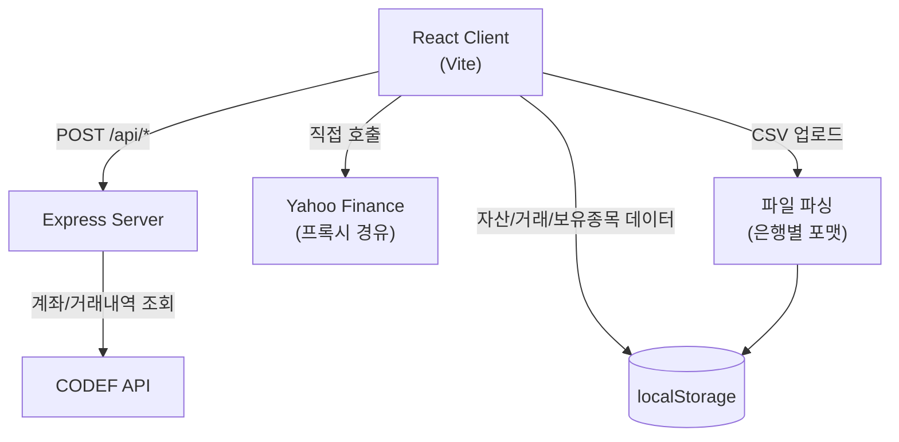

# 💰 Smart Wallet Dashboard

개인 자산을 한눈에 관리하는 대시보드입니다.

> 이 프로젝트는 Claude와의 대화를 통해 코드를 받아 구현했으며, 로직 검토도 Claude의 도움을 받았습니다.
> 직접 수정한 부분은 주로 UI 스타일링과 문구이며, 기능 방향과 문제 해결 아이디어는 직접 제시했습니다.

## 왜 만들었나

이직을 준비하는 기간 동안 수입이 없다 보니 자산 흐름을 매일 확인할 방법이 필요했습니다. 토스 같은
자산 관리 앱들이 모바일 중심이라 PC 환경에서 편하게 볼 수 있는 곳이 마땅치 않아서, 직접 만들었습니다.
전체 자산 현황, 한 달 지출 관리, 주식 계좌 손익 확인을 한 화면에서 보는 게 목적입니다.

## 아키텍처

- **CODEF 연동**: 클라이언트가 Express 서버에 요청을 보내면, 서버가 CODEF API와 통신해 계좌·거래내역을 가져옵니다. 카드/계좌 등록 시 필요한 인증 정보는 클라이언트에서 서버로 전달됩니다.
- **주식 시세**: Yahoo Finance는 프록시를 경유해 클라이언트에서 직접 호출합니다.
- **데이터 저장**: 실거래 데이터, 보유 종목, 수동 잔고, 데모 모드 여부는 모두 localStorage에 저장되어 새로고침 후에도 유지됩니다.
- **CSV 업로드**: 은행별로 다른 CSV/TXT 포맷을 파싱해 localStorage 데이터로 변환합니다.

## 🛠 기술 스택

## 🔗 배포

- **프론트엔드**: [Vercel](https://smart-wallet-dashboard-omega.vercel.app)
- **백엔드**: [Render](https://smart-wallet-dashboard-server.onrender.com)

> ⚠️ 백엔드는 Render 무료 플랜으로 운영 중입니다. 15분 이상 요청이 없으면 슬립 모드로 전환되어 첫 요청 시 50초 이상 지연될 수 있습니다.

## ✨ 주요 기능

- 📊 **Dashboard** - 총 자산(가용/저축/투자 분리), 이번 달 수입/지출, 월별 추이 차트, 지출 목표 게이지
- 🏦 **Accounts** - 은행/저축/투자/카드/페이 계좌 통합 관리
- 📋 **Transactions** - 카테고리 자동 분류, 날짜 범위/수입출/카테고리 필터
- 📈 **Investments** - 실시간 주식 시세 + 환율 변환, 시장 지표 티커 배너
- 🔔 **Subscriptions** - 구독 서비스 캘린더, 결제일 도트 표시, 다국가 통화 + 환율 자동 변환
- 📤 **Upload** - CSV 업로드 + CODEF API 자동 연동 + 수동 잔고 입력

## 🏦 지원 CSV 파일

| 기관 | 형식 | 계좌 타입 |
|---|---|---|
| 카카오뱅크 | txt (공백 구분) | 입출금/저축 선택 |
| 토스뱅크 | CSV | 입출금/저축 선택 |
| 카카오페이 | CSV | - |
| 우리은행 | CSV | 입출금/저축 선택 |
| 케이뱅크 | CSV | 입출금/저축 선택 |

## 🤖 CODEF API 자동 연동

| 기관 | 연동 항목 | 상태 |
|---|---|---|
| 신한은행 | 잔액 + 거래내역 | ✅ 연동 완료 |
| 현대카드 | 승인내역 | ✅ 연동 완료 |
| 카카오뱅크 | - | ❌ 간편인증(카카오톡) 방식으로 CODEF 미지원 |
| 토스뱅크 | - | ❌ 앱 전용 서비스로 ID/PW 로그인 불가 |
| 케이뱅크 | - | ❌ 2023년 3월 개인뱅킹 웹 서비스 종료로 CODEF 지원 중단 |
| NH투자증권 | - | ❌ 공동인증서 필수 + Open API가 Windows 전용 DLL 기반 |

## 트러블슈팅 & 배운 점

**CODEF 연동 중 중복 요청 버그**
연동 버튼이 API 응답을 기다리는 동안에도 계속 활성화 상태로 남아있어, 사용자가 응답 지연 중
버튼을 다시 누르면 요청이 중복으로 발생하는 문제를 발견했습니다. Flipster 안드로이드 검증 당시
비동기 응답 지연 상황에서 발생하던 결함을 다루던 경험이 있어, 연동 중임을 시각적으로도 구분해야
한다고 판단해 요청이 진행되는 동안 버튼을 비활성화하고 별도 상태로 표시하도록 방향을 잡았습니다.

**유안타 예수금 수동 잔고 유지 결정**
투자 계좌 예수금 통합 작업 중, 유안타증권 수동 잔고 항목을 없애자는 방향이 나왔지만
"다른 증권사(NH투자)도 예수금이 있는데 유안타만 없애면, 나중에 유안타에 추가 입금하거나
예수금이 새로 생기면 어떻게 반영하냐"는 반례를 제기해 별도 수동 잔고 항목으로 유지하는
구조로 방향을 바꿨습니다. 특정 케이스만 보고 일반화하면 놓치는 예외가 있다는 걸,
QA 시절 습관대로 다른 계좌 유형까지 확장해서 검증한 결과입니다.

**결제 추적 방식의 현실적 선택**
네이버페이/카카오페이 결제 내역을 자동으로 추적하는 방법으로 Gmail API 파싱과
충전금 흐름 추적 두 가지 안이 있었는데, Gmail API 파싱은 구현 복잡도 대비 실효성이
낮다고 판단해 충전금 흐름을 추적하는 방식으로 정했습니다. 로드맵의
"네이버페이/카카오페이 거래내역 자동 동기화(현실적 제약으로 보류)" 항목은 이 판단의 결과입니다.

**월별 추이 차트의 데이터 한계 사전 인지**
월별 지출 추이 차트 기능 자체는 좋은 방향이었지만, 실제 데이터가 4월부터 쌓이기 시작해
2개월치 추이밖에 보여줄 수 없다는 한계를 미리 짚었습니다. 기능을 만들기 전에 그 기능이
실제로 유의미한 결과를 보여줄 수 있는지 데이터 조건부터 확인하는 습관입니다.

 

## 🗺 로드맵

- [x] 더미 데이터 기반 대시보드 UI
- [x] 다크모드 토글
- [x] CSV 업로드 및 파싱 (카카오뱅크, 토스뱅크, 카카오페이, 우리은행, 케이뱅크)
- [x] 카테고리 자동 분류 및 지출이체 구분
- [x] 다계좌 연동 및 실제 잔액 반영
- [x] 가용/저축/투자 자산 분리
- [x] 계좌 타입 선택 (입출금/저축)
- [x] 투자 페이지 - Yahoo Finance 실시간 시세 연동 (한국/미국 주식)
- [x] 시장 지표 티커 배너 (KOSPI, KOSDAQ, NASDAQ, S&P500, USD/KRW)
- [x] 할부 처리 자동 계산
- [x] 투자 계좌 예수금 통합
- [x] 수동 잔고 입력 기능 (은행/투자 예수금/페이)
- [x] 이번 달 지출 목표 게이지
- [x] Transactions 날짜 범위/카테고리/수입출 필터
- [x] 백엔드 서버 (Node.js + Express)
- [x] CODEF API 신한은행 자동 연동
- [x] CODEF API 현대카드 자동 연동
- [x] 앱 시작 시 CODEF 자동 갱신
- [x] 월별 수입/지출 추이 차트
- [x] 구독 관리 페이지 (캘린더, 다국가 통화, 결제 주기)
- [x] 다크모드 전환 transition 개선
- [x] Render 백엔드 배포
- [x] Vercel 프론트엔드 배포
- [x] 더미 데이터 갱신
- [x] Accounts 페이지 파비콘 추가
- [x] Sidebar 모드 표시 개선
- [x] 코드 리팩토링 (constants.js, utils.js 분리)
- [x] Transactions 날짜 필터 버그 수정
- [x] CODEF 연동 중 버튼 비활성화 처리
- [ ] 네이버페이/카카오페이 거래내역 자동 동기화 (현실적 제약으로 보류)

## 👤 Developer

Developed by **yoobi lee**